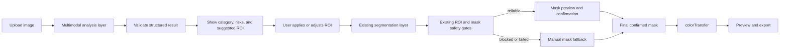

# Multimodal AI API Integration Plan

## 1. 背景与目标

当前项目已经具备 React/Vite 前端、FastAPI `ai-server`、lightweight ONNX segmentation、ROI / mask safety gates、手动蒙版兜底和 Electron + PyInstaller Windows 桌面 POC。

现有 ONNX 路径在白底、主体清晰或合理 ROI 场景中可以提供初始 mask，但真实浏览器与回归测试仍显示以下不足：

- 挂拍裤子、衣架、金属杆和夹具容易与服装主体混淆。
- 主体贴边、复杂背景、局部近景可能产生 partial、over-coverage 或 low-confidence mask。
- 当前模型只输出分割类别概率，缺少对场景、道具和风险的语义理解。
- 为避免色块，系统需要较严格的 safety gate，因此部分可处理图片会安全失败并转为手动蒙版。

引入多模态 AI 的目标不是替换现有 segmentation，而是在 segmentation 之前增加一个语义分析层，用于：

- 判断服装类别和主体描述。
- 找到更合理的主体位置并建议 ROI。
- 识别衣架、金属夹具、皮肤、复杂背景和贴边风险。
- 判断是否值得继续自动 segmentation，或应直接建议手动蒙版。
- 为用户提供可理解的失败原因和下一步操作建议。

成功标准是减少无效识别和手动试错，而不是提高未经复核的自动 success 数量。

## 2. 不建议纯替代现有分割的原因

多模态模型通常擅长图像理解、目标描述和粗粒度定位，但不保证稳定输出像素级精确 mask：

- bounding box 或 polygon 可能只覆盖主体大致区域。
- 服装边缘、裤腿间隙、袖口、褶皱和半透明区域需要像素级 mask。
- 模型输出可能受提示词、供应商版本和服务端更新影响。
- 低分辨率视觉输入可能忽略夹具、细杆和贴边区域。
- JSON 格式正确不等于几何结果合理。

服装校色对边界准确度敏感。错误 mask 会直接造成背景染色、夹具染色或局部色块。因此：

1. 多模态结果只能作为分析和 ROI 建议。
2. 建议 ROI 必须经过本地边界、尺寸和风险校验。
3. 最终仍由现有 segmentation 生成 mask。
4. mask 仍必须经过现有 safety gates。
5. 用户必须能预览和手动修正最终 mask。
6. 只有最终确认后的 mask 才能进入 `colorTransfer`。

## 3. 推荐架构



分层职责：

| 层 | 职责 | 不允许做的事 |
| --- | --- | --- |
| Multimodal analysis | 类别、主体描述、建议 ROI、风险和用户提示 | 直接写入 targetMask 或调用 `colorTransfer` |
| Segmentation | 使用本地 ONNX 等 provider 生成像素级 mask | 绕过 ROI / mask safety gate |
| Safety gate | 阻断 partial、over-coverage、low-confidence 等结果 | 为提高 success 率自动放宽阈值 |
| Manual mask | 用户修正最终校色范围 | 被自动分析层删除或跳过 |
| colorTransfer | 仅在最终有效 mask 内迁移颜色 | 接收未经确认的分析结果 |
| Export | 导出当前有效处理结果 | 复用 blocked 或 stale result |

建议新增独立 `multimodal provider`，不要把第三方 API 调用塞入现有 `segmenters/`。二者可以共享输入元数据，但返回契约和责任不同。

## 4. 多模态 AI 输出建议

推荐使用严格、可版本化的 JSON schema：

```json
{
  "schemaVersion": "1.0",
  "garmentCategory": "trouser",
  "garmentDescription": "gray hanging trousers",
  "suggestedRoi": {
    "x": 320,
    "y": 460,
    "width": 1280,
    "height": 2160
  },
  "suggestedPolygon": [
    { "x": 420, "y": 520 },
    { "x": 1560, "y": 520 },
    { "x": 1420, "y": 2520 },
    { "x": 520, "y": 2520 }
  ],
  "confidence": 0.82,
  "riskTags": ["hanger", "metal_clip"],
  "containsHanger": true,
  "containsMetalClip": true,
  "edgeTouching": false,
  "complexBackground": false,
  "recommendManualMask": true,
  "userMessage": "检测到衣架和金属夹具，建议应用 ROI 后检查蒙版，必要时使用手动蒙版。"
}
```

字段约束：

| 字段 | 约束 |
| --- | --- |
| `garmentCategory` | 使用内部枚举，如 `trouser`、`jacket`、`polo`、`tshirt`、`shirt`、`dress`、`skirt`、`unknown`。 |
| `garmentDescription` | 简短描述，不作为业务决策的唯一依据。 |
| `suggestedRoi` | 基于原始图片像素坐标，格式为 `x/y/width/height`，必须在后端验证边界。 |
| `suggestedPolygon` | 可选；只用于可视化或未来提示分割，不直接成为最终 mask。 |
| `confidence` | 归一化到 `0-1`；仅作参考，不替代本地质量门。 |
| `riskTags` | 内部受控枚举，避免依赖供应商自由文本。 |
| `containsHanger` | 是否包含衣架。 |
| `containsMetalClip` | 是否包含金属夹、挂杆等道具。 |
| `edgeTouching` | 服装主体是否触碰图片边缘。 |
| `complexBackground` | 是否存在复杂背景或多个显著对象。 |
| `recommendManualMask` | 是否建议直接进入手动蒙版流程。 |
| `userMessage` | 面向用户的可执行提示，后端应限制长度并做安全转义。 |

建议补充内部诊断字段：`requestId`、`provider`、`providerModel`、`latencyMs`、`imageWidth`、`imageHeight` 和 `warnings`。不要把 API Key、完整供应商响应或图片内容写入普通日志。

## 5. API Key 管理方案

### 5.1 每个组员本地填写 API Key

做法：每位组员使用自己的 Key，通过本地环境变量提供给 FastAPI sidecar。

```powershell
$env:MULTIMODAL_AI_API_KEY="<local-only>"
```

优点：

- POC 成本最低。
- 不需要部署公司服务。
- 每个人的调用和配额相互隔离。

缺点与风险：

- 配置门槛较高。
- Key 可能出现在 shell history、进程环境或截图中。
- 难以统一配额、审计、供应商切换和撤销。
- 不适合向大量普通组员分发。

适用阶段：Phase 2/3 开发和少量内部验证。

### 5.2 公司内部代理服务

做法：前端或桌面 sidecar 调用公司内部 API，只有代理服务持有第三方 Key。

优点：

- Key 不下发到客户端。
- 可集中做鉴权、限流、预算、审计、脱敏和供应商切换。
- 可统一图片保留策略和错误处理。
- 最适合受控内部发布和后续规模化。

缺点与风险：

- 需要部署、监控和维护内部服务。
- 增加一跳网络延迟和可用性依赖。
- 代理本身必须满足图片隐私和访问控制要求。

适用阶段：正式内部推广的首选方案。

### 5.3 Electron 桌面端本地设置页

做法：用户在 Electron 设置页录入自己的 Key，由 main process 使用 Windows Credential Manager、Electron `safeStorage` 或等效 OS 级安全存储保存。renderer 只能获知“已配置/未配置”，不能读取明文 Key。

优点：

- 使用体验优于手动环境变量。
- 可支持 BYOK（Bring Your Own Key）。
- 可在 Electron main process 中控制读取、更新和清除。

缺点与风险：

- 本地设备被控制时仍可能泄露。
- `safeStorage` 需要把加密 blob 写入本地文件，仍需设计权限、迁移和清除流程。
- Key 注入 sidecar 环境变量时可能被同用户权限的进程观察。
- 不能把 Key 放入 renderer、`localStorage`、preload 返回值或明文 JSON。

适用阶段：公司允许 BYOK 且没有内部代理时的后续方案。

### 5.4 推荐顺序

1. 开发 POC：本地环境变量。
2. 内部推广：公司内部代理服务，推荐。
3. BYOK 桌面体验：Electron 安全设置页，作为可选补充。

无论采用哪种方式，都不得把公司共享 Key 写入前端 bundle、Git、Electron `app.asar`、PyInstaller exe、安装脚本或默认配置文件。

## 6. 推荐的第一阶段实现

第一阶段应只实现“分析建议”，不改动 color transfer：

1. 后端新增 `multimodal providers` 抽象。
2. 实现 deterministic mock provider，返回固定 schema 和可测试的风险组合。
3. 新增 `/analyze-garment`，与 `/segment-garment` 分离。
4. API Key 只由 FastAPI 进程从环境变量或受控桌面配置读取。
5. 前端增加“多模态识别”或上传后的可选预分析步骤。
6. 显示类别、风险、建议 ROI 和手动蒙版建议。
7. 用户点击“一键应用建议 ROI”后，仍调用现有 segmentation。
8. 现有 safety gate、manual mask 和 stale-result 清理全部保留。
9. 不修改 `colorTransfer` 的参数和调用契约。

建议后端目录：

```txt
ai-server/
  multimodal/
    base.py
    registry.py
    mock_provider.py
    external_provider.py
```

建议 provider 契约：

```python
class MultimodalProvider:
    def analyze(self, input: GarmentAnalysisInput) -> GarmentAnalysisResult:
        ...
```

mock provider 必须支持超时、低置信度、无效 ROI、风险标签和 provider failure 等测试场景。

## 7. 后端接口设计

### `POST /analyze-garment`

请求类型：`multipart/form-data`

输入：

| 字段 | 必需 | 说明 |
| --- | --- | --- |
| `image` | 是 | JPG、PNG 或 WebP。 |
| `role` | 是 | `reference` 或 `target`。 |
| `roi` | 否 | 用户已有 ROI，JSON `x/y/width/height`。 |
| `sampleId` | target 建议 | 前端样品 ID，仅用于关联和诊断。 |
| `imageWidth` | 建议 | 原图宽度。 |
| `imageHeight` | 建议 | 原图高度。 |

成功响应：

```json
{
  "success": true,
  "analysis": {
    "schemaVersion": "1.0",
    "garmentCategory": "trouser",
    "garmentDescription": "gray hanging trousers",
    "suggestedRoi": { "x": 320, "y": 460, "width": 1280, "height": 2160 },
    "suggestedPolygon": null,
    "confidence": 0.82,
    "riskTags": ["hanger", "metal_clip"],
    "containsHanger": true,
    "containsMetalClip": true,
    "edgeTouching": false,
    "complexBackground": false,
    "recommendManualMask": true,
    "userMessage": "建议应用 ROI 后检查蒙版，必要时使用手动蒙版。"
  },
  "message": "analysis completed"
}
```

失败响应：

```json
{
  "success": false,
  "errorCode": "provider_timeout",
  "message": "多模态识别超时，可继续使用本地 AI 或手动蒙版。"
}
```

后端必须执行：

- 文件类型、体积和解码校验。
- EXIF orientation 统一。
- ROI 数值、边界、最小尺寸和最大覆盖率校验。
- provider JSON schema 校验和枚举归一化。
- 超时、重试次数、并发和响应体大小限制。
- `suggestedRoi` 越界时拒绝或裁正并返回 warning，不能静默信任。
- `recommendManualMask=true` 时禁止自动触发校色。

接口不返回最终 `mask`，也不返回可直接用于 `colorTransfer` 的数据。

## 8. 前端交互设计

推荐流程：

1. 用户上传图片。
2. 用户点击“多模态识别”，或开启“上传后预分析”。
3. 页面显示分析状态，不阻塞手动蒙版入口。
4. 成功后展示：类别、置信度、风险标签、建议 ROI 和说明。
5. 用户可点击“一键应用建议 ROI”。
6. 应用 ROI 只更新 ROI 状态，并清理对应 stale result。
7. 用户再执行现有 remote AI segmentation。
8. segmentation 通过 safety gate 后显示 mask 预览。
9. 不可靠结果引导用户调整 ROI 或使用手动蒙版。
10. 只有最终 mask 确认后，现有校色按钮才可执行。

建议 UI 状态：

- `idle`
- `analyzing`
- `analysis-ready`
- `analysis-low-confidence`
- `analysis-failed`
- `roi-suggested`
- `manual-mask-recommended`

建议文案示例：

- “检测到衣架和金属夹具，AI 建议仅供定位，请检查 ROI 后再识别蒙版。”
- “主体贴近图片边缘，建议手动蒙版，以避免背景被校色。”
- “多模态服务不可用，已保留本地 ONNX 和手动蒙版功能。”

禁止交互：分析成功后自动调用 `colorTransfer`，或将 suggested polygon 直接保存为最终 targetMask。

## 9. Electron 桌面版适配

### 9.1 Key 录入

未来设置页应由 Electron main process 管理：

- renderer 通过受限 IPC 发起“保存/清除/测试连接”。
- preload 只暴露特定方法，不暴露任意文件或进程 API。
- UI 仅显示掩码后的 Key 尾号和配置状态。
- 禁止在 DevTools、console、错误提示和遥测中输出 Key。

### 9.2 Key 存储

推荐顺序：

1. 公司代理：客户端不存第三方 Key。
2. Windows Credential Manager 或 OS 级凭据存储。
3. Electron `safeStorage` 加密后保存 blob；配置文件只保存密文和非敏感 provider 信息。
4. 开发阶段环境变量。

不推荐：明文 `.json`、`.env` 随安装包分发、renderer `localStorage`、写死在 `desktop/main.cjs` 或 PyInstaller sidecar。

### 9.3 sidecar 注入

如果采用本地 Key，Electron main process 可在启动 sidecar 时注入临时环境变量。需要：

- 不打印 child environment。
- 不把 Key 写入 command line 参数。
- 退出时清理内存引用。
- 设置页更新 Key 后安全重启 sidecar。

更高安全要求下，应优先使用内部代理，避免客户端持有公司共享 Key。

### 9.4 离线降级

多模态 API 不可用时：

1. 保留本地 lightweight ONNX。
2. 保留 ROI 和所有现有 safety gates。
3. 保留手动蒙版编辑。
4. 显示“在线分析不可用，不影响本地识别和手动校色”。
5. 不因网络失败复用旧 analysis 或旧 processed result。

## 10. 安全与隐私

多模态 API 会把图片发送给第三方或内部代理，实施前必须确认：

- 是否允许上传客户、模特、品牌、未发布商品或商业机密图片。
- 供应商是否保存输入、用于训练或跨区域处理。
- 数据处理区域、保留周期、删除机制和合同条款。
- 是否需要用户授权、隐私提示和内部审批。
- 是否应在上传前删除 EXIF、GPS、文件名和无关 metadata。
- 是否需要限制图片尺寸、数量、并发和单日预算。
- 日志是否脱敏，不记录 API Key、图片 base64、完整提示词或供应商原始响应。
- 内部代理是否需要访问控制、审计、速率限制和异常告警。

高风险素材默认不应上传第三方 API。在政策未确认前，只能使用经批准的内部测试图片或 mock provider。

## 11. 失败兜底

| 失败类型 | 处理方式 | 是否进入校色 |
| --- | --- | --- |
| API 超时 | 显示超时，允许继续本地 ONNX 或手动蒙版 | 否 |
| API Key 无效 | 显示配置错误，不回显 Key | 否 |
| 余额不足 / 配额耗尽 | 显示服务不可用，记录非敏感错误码 | 否 |
| 限流 | 有界退避重试一次，随后降级 | 否 |
| 低置信度 | 标记风险并建议手动蒙版 | 否 |
| JSON/schema 无效 | 后端拒绝结果并记录 schema 错误 | 否 |
| ROI 越界或过宽 | 拒绝应用，要求用户调整 | 否 |
| provider 不可用 | 降级到本地 ONNX + safety gate | 仅最终可靠 mask 可进入 |
| 本地 ONNX 也失败 | 使用手动蒙版 | 仅用户确认 mask 后进入 |

任何降级都不得把多模态建议当作最终 mask，也不得绕过 blocked / failed 状态。

## 12. 验收指标

### 12.1 效果指标

- 多模态建议后需要手动重画 ROI 的比例。
- 最终需要手动蒙版的图片比例是否下降。
- 衣架、背景、金属杆和夹具误选率是否下降。
- 挂拍裤子、复杂背景和 edge-touching 场景的可靠 mask 通过率。
- suggested ROI 被用户采用、修改或拒绝的比例。

### 12.2 安全指标

- 多模态结果直接进入 `colorTransfer` 的次数必须为 `0`。
- safety gate 绕过次数必须为 `0`。
- blocked / failed 后生成 processed / adjusted result 的次数必须为 `0`。
- false pass 和色块风险不得高于当前回归基线。
- 导出中出现 stale result 的次数必须为 `0`。

### 12.3 服务指标

- API 成功率、超时率、P50/P95 latency。
- 单图成本、每日调用量、配额失败率。
- provider schema 错误率和无效 ROI 率。
- 隐私审批覆盖率和脱敏日志检查结果。

评估应覆盖至少 50-100 张真实且获准使用的图片，并保留 no-analysis 对照组，避免只看少量成功样本。

## 13. 分阶段实施计划

### Phase 1：设计文档

- 锁定职责边界、schema、Key 管理和隐私要求。
- 不修改现有代码行为。

### Phase 2：后端 provider + mock provider

- 新增 provider 抽象、registry 和 mock。
- 新增 `/analyze-garment`。
- 增加 schema、ROI、超时和错误映射测试。
- 不接真实外部 API。

### Phase 3：真实 API provider

- 先使用开发人员本地环境变量。
- 接入一个经批准的 provider。
- 增加超时、限流、配额和隐私控制。
- 禁止前端持有 Key。

### Phase 4：前端识别建议 UI

- 增加多模态分析按钮和状态。
- 展示风险与建议 ROI。
- 支持用户确认后应用 ROI。
- 保持 segmentation、safety gate 和 manual mask 流程不变。

### Phase 5：Electron API Key 设置

- 优先评估内部代理。
- 如需 BYOK，再实现 main-process 安全设置页和 OS 级存储。
- 增加 Key 测试、清除和 sidecar 重启。

### Phase 6：真实样本回归

- 使用 50-100 张获准业务图。
- 对比无多模态、多模态建议、本地 ONNX 和手动蒙版路径。
- 验证 false pass、色块、stale result、导出和成本。

每个 Phase 使用独立任务和验收，不应一次性实现全部功能。

## 14. 不允许事项

- 不提交任何真实 API Key、token、账号或代理凭据。
- 不把 Key 写入源码、前端 bundle、Git、Electron `app.asar`、PyInstaller exe 或安装包默认配置。
- 不在 URL、命令行参数、日志、错误提示、遥测或 debug JSON 中暴露 Key。
- 不让 renderer 直接调用第三方 API。
- 不绕过 ROI / mask safety gate。
- 不让多模态分析结果直接写入最终 targetMask。
- 不让多模态分析成功自动触发 `colorTransfer`。
- 不删除或弱化手动蒙版兜底。
- 不在隐私审批完成前上传真实客户或商业敏感图片。
- 不为了提高自动 success 率放宽现有 blocked / failed 规则。

## 15. 下一步 Codex 实施建议

建议严格按以下顺序执行：

1. **先做 mock provider**：锁定输入、输出、错误码和 ROI 校验；不需要 API Key。
2. **再做真实 provider**：只在后端接入，经环境变量读取开发 Key，并增加超时和隐私保护。
3. **再做前端 UI**：展示分析建议和风险，用户确认后才能应用 ROI。
4. **最后做 Electron 设置页**：先决定内部代理还是 BYOK，再选择 OS 凭据存储方案。
5. **最后进行真实样本回归**：确认没有增加 false pass、色块和导出风险后再进入候选发布。

下一项建议任务：`Task Multimodal-2A - add backend multimodal provider abstraction and deterministic mock provider`。该任务只新增 provider、schema、mock、接口和后端测试，不接真实 API、不改前端、不改 segmentation 和 `colorTransfer`。
